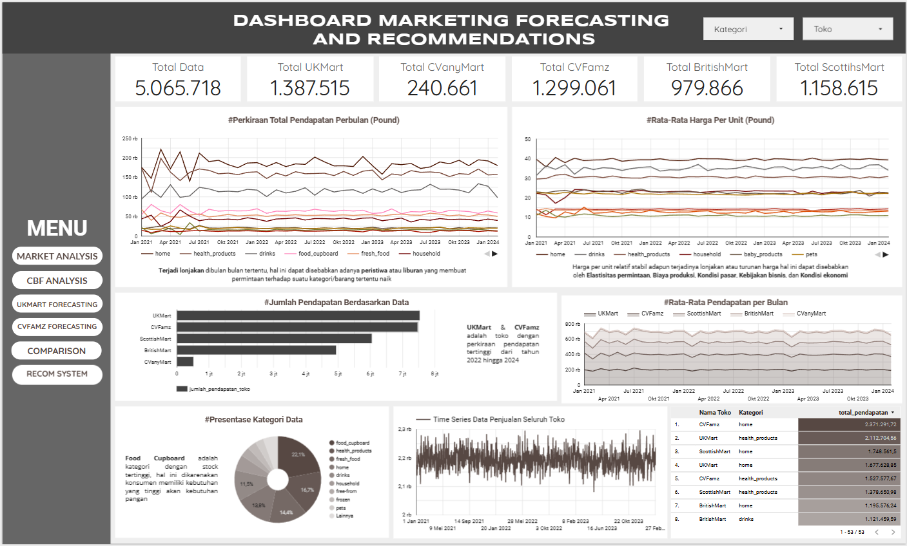
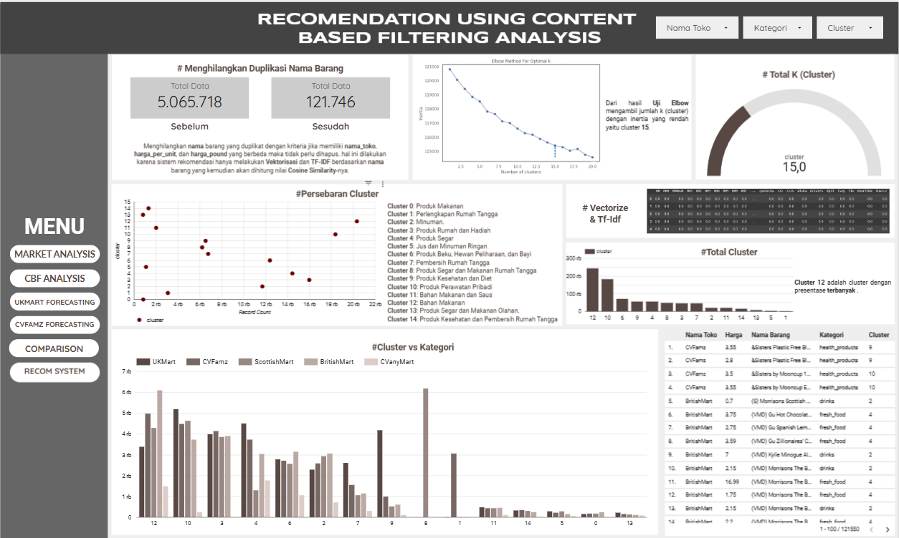
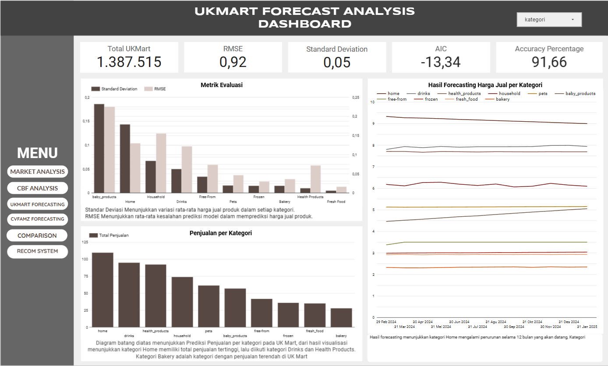
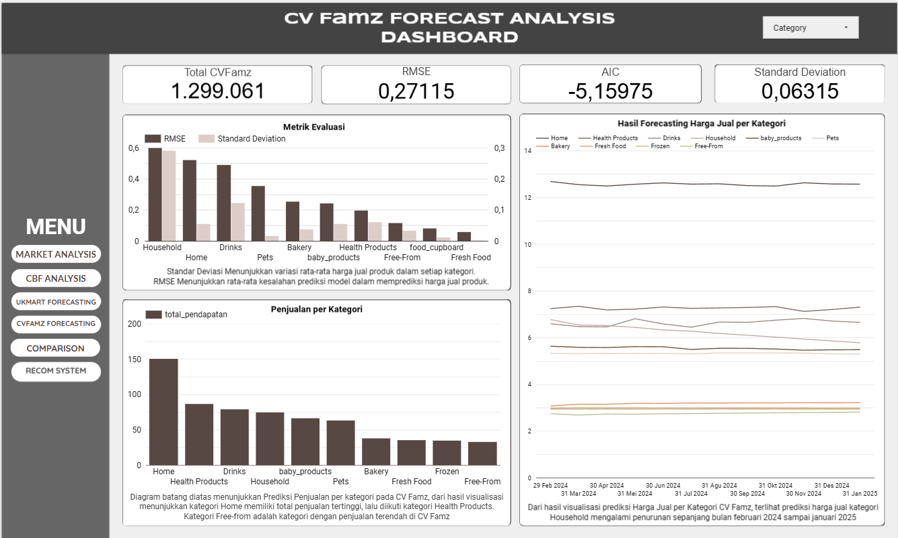
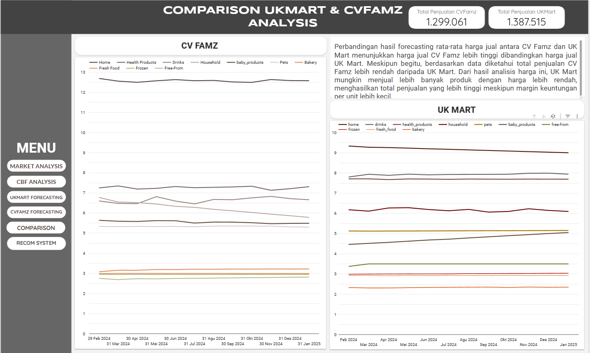

# Machine Learning: Analisis Penjualan Produk dan Harga di Supermarket

## Project Overview
Project ini bertujuan untuk menganalisis pola penjualan produk dan harga di supermarket menggunakan teknik machine learning dan data analysis.

Analisis dilakukan untuk menemukan insight terkait:
- pola pembelian pelanggan
- hubungan antara harga dan jumlah penjualan
- kategori produk dengan performa terbaik

## Dataset
Dataset berisi informasi transaksi penjualan supermarket seperti:
- tanggal transaksi
- kategori produk
- harga
- jumlah pembelian
- kota penjualan

## Methods
Metode yang digunakan dalam analisis ini meliputi:
- Data preprocessing
- Exploratory Data Analysis (EDA)
- Machine Learning modeling
- Data visualization

---

# 📊 Dashboard Visualization

### 1. Dashboard Market Analisis

### 2. Dashboard CBF Analisis

### 3. Dashboard UKMart Forecasting

### 4. Dashboard CVFamz Forecasting

### 5. Dashboard Comparison

---

## Tools & Libraries
- Python
- Pandas
- Scikit-learn
- Matplotlib
- Seaborn

## Output Analysis
Hasil analisis berupa visualisasi data dan model machine learning untuk memahami pola penjualan produk di supermarket.
